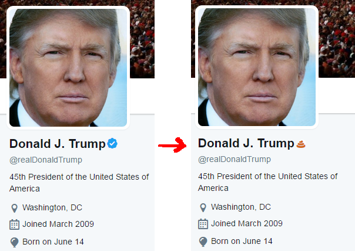
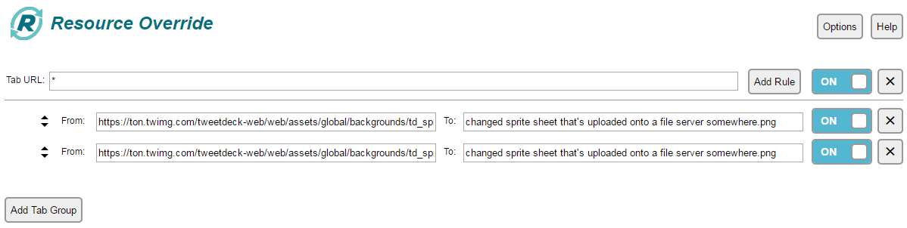

# TwitterSunglasses
PUT ON THE GLASSES.

So: on Twitter, the Verified icon is basically a sign of negative quality.

This Chrome extension changes the Twitter Verified Icon into a brown poop emoji.

 

<b><a href="https://chrome.google.com/webstore/detail/twitter-verified-account/ajgilddapndgbmniliponchegglobphm">Official Chrome Web Store Extension</a></b>
 
<b><a href="https://github.com/icze4r/TwitterSunglasses/blob/master/Twitter-Verified-Account-Sunglasses_v0.1.0.crx">Github hosted copy of Chrome extension</a></b>
 
<b><a href="https://addons.mozilla.org/en-US/firefox/addon/twitter-verified-sunglasses/">Official Mozilla Firefox Add-on</a></b>
 
<b><a href="https://github.com/icze4r/TwitterSunglasses/blob/master/Twitter%20Verified%20Account%20Sunglasses%20-%20Version%200.1.0%20-%20Foxified.xpi">Github hosted copy of Firefox Add-on</a></b>
 
<b><a href="https://github.com/icze4r/TwitterSunglasses/blob/master/tampermonkey-script.txt">Tampermonkey Script</a></b>

 

<b>The Effect</b>

 

   
<b>HOW TO INSTALL</b>

It's simple.  <a href="https://github.com/icze4r/TwitterSunglasses/archive/master.zip">Download the zip</a> of the extension, unzip it, open up chrome://extensions, and drag and drop the unzipped folder into the Extensions panel.

It all works automatically.

   
<b>Why doesn't this work on TweetDeck?</b>

<b>Because I would prefer to not be sued into oblivion.</b>  TweetDeck works differently, anyways: if you want to do it yourself (which I'm pretty sure is perfectly legal), just get a Find-Replace Chrome Extension / Firefox add-on that can replace the sprite sheets that Twitter uses.  The sprite sheets contain the Verified checkmarks that TweetDeck uses.  If you download them, you can edit them into whatever you want.

   
<b>INSTRUCTIONS TO MAKE THIS WORK ON TWEETDECK</b>

The Verified checkmarks on TweetDeck are contained in two sprite sheets:
https://ton.twimg.com/tweetdeck-web/web/assets/global/backgrounds/td_sprite_sheet_2015_@2x.e241845e00.png
https://ton.twimg.com/tweetdeck-web/web/assets/global/backgrounds/td_sprite_sheet_2015_@1x.553e652b2d.png

Download both, shove them into Photoshop or whatever you use, and change the icons into what you want.

Done?  Okay, download Resource Override: https://chrome.google.com/webstore/detail/resource-override/pkoacgokdfckfpndoffpifphamojphii?hl=en

This is what your setup should look like:

You're going to need to upload the modified sprite sheets somewhere for this to work.  I don't think it works if you just put a localhost / file:/// reference in.

If you do that, it should work.
